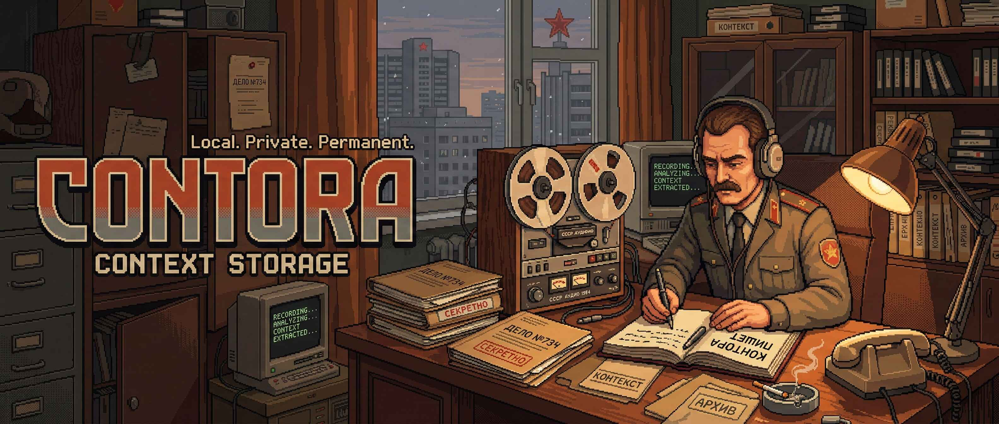

# Contora



**Contora** is a local context archive for people who turn information into leverage.

> Context Storage. Local. Private. Permanent.

Contora captures work conversations, transcribes them locally, and turns raw audio into structured, usable context.  
The core principle is simple: your data stays on your machine.

## Positioning

- **Invisible Capture:** System-level recording workflow without cloud meeting infrastructure.
- **Total Sovereignty:** Local processing and local storage by default.
- **From Audio to Action:** Not just recordings, but a pipeline from sound to structured output.

## Core Features

- System audio recording (WASAPI loopback) and microphone recording.
- Audio import: `WAV`, `MP3`, `FLAC`, `OGG`, `M4A`, `OPUS`.
- Video import: `MP4`, `M4V`, `MOV`, `AVI`, `MKV`, `WEBM`, `WMV`.
- Automatic audio extraction from video to MP3 via `ffmpeg`.
- Local transcription with `faster-whisper-xxl`.
- Speaker diarization.
- Transcript editing and speaker renaming in the UI.
- Timestamp-based audio playback navigation.
- In-app updates via Velopack + GitHub Releases.

## Whisper Runtime and Models

Contora is shipped without bundled Whisper runtime/model binaries in the installer.

- Runtime and model are downloaded from the app when needed.
- Canonical runtime path:
  - `%LocalAppData%\Contora\runtime\faster-whisper-xxl\`

Primary environment variables:

- `CONTORA_WHISPER_EXE`
- `CONTORA_WHISPER_ROOT`
- `CONTORA_WHISPER_MODELS_DIR`
- `CONTORA_WHISPER_MODEL_LARGE_V2_DIR`

Backward compatibility:

- Legacy `AudioRecorder` paths are still supported when present.
- Legacy `AUDIORECORDER_*` environment variables are also recognized.

## ffmpeg Resolution

For video-to-audio conversion, Contora resolves `ffmpeg` in this order:

1. `CONTORA_FFMPEG_EXE` environment variable.
2. `ffmpeg.exe` next to `faster-whisper-xxl.exe` runtime.
3. `ffmpeg.exe` in the app directory.
4. `ffmpeg` from `PATH`.

## Installation (End Users)

1. Open releases: `https://github.com/iamniketas/contora/releases`
2. Download `Contora-win-Setup.exe` from **Assets**.
3. Run the installer and launch **Contora** from Start Menu.

## Development Quick Start

Requirements:

- Windows 10/11
- .NET SDK 8+
- Visual Studio 2022 (for WinUI 3 development)

Build:

```bash
dotnet build Contora.sln
```

Run from repository root:

```powershell
.\build-and-run.ps1
```

## Project Structure

- `Contora.sln` - solution
- `src/AudioRecorder.App` - WinUI desktop app
- `src/AudioRecorder.Core` - domain models and interfaces
- `src/AudioRecorder.Services` - recording, transcription, conversion, updates

## Brand and Tone

Contora follows a clear voice:

- Professional, direct, and efficient.
- Privacy-first and local-first.
- Minimal interface, high informational value.

Key messages:

- **Capture the context, not just the sound.**
- **Your private intelligence agency.**
- **Free, Local, Unstoppable.**

## Legal

Use recording features only in compliance with laws in your jurisdiction.  
The user is responsible for obtaining any required consent from participants.
